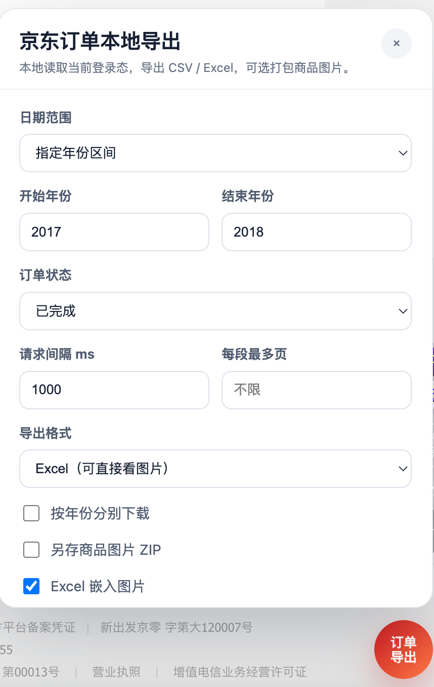

# 京东订单本地导出

一个本地 Chrome 扩展，在京东“我的订单”页面右下角显示导出面板，可手动选择导出范围并下载 CSV / Excel，可选把商品图片打包成 ZIP 保存。

建议在Chrome设置里取消“下载前询问”，防止每个文件都需要点确认。

如果中途失败，可以手动按年下载。

## 安装

1. 打开 Chrome：`chrome://extensions/`
2. 打开右上角“开发者模式”
3. 点击“加载已解压的扩展程序”
4. 选择扩展目录：`jd-order-exporter`
5. 如果之前已经安装过旧版，修改后请点击扩展卡片上的“重新加载”

## 使用

1. 登录京东并打开“我的订单”：`https://order.jd.com/center/list.action`
2. 点击右下角“订单导出”
3. 选择日期范围、订单状态、请求间隔、每段最多页、导出格式；
4. 点击“开始导出”

导出文件会通过浏览器下载到本地，数据只在当前浏览器中读取，不会上传到任何服务器。

## 参数说明

- 日期范围：默认“指定年份区间”，支持当前年份、指定年份区间、全量。
- 开始年份：最小为 2008，默认 2017；结束年份不设上限。
- 订单状态（建议只导出`已完成`）：支持 `全部状态`、`已完成`、`已取消`。状态筛选在本地完成，便于正确处理拆分订单。
- 请求间隔：建议 800-1500ms，太低可能触发风控或页面异常。
- 每段最多页：留空表示不限；试跑时可以填 `1` 或 `2`。
- 导出格式：CSV 会写入图片地址文本；Excel 会额外嵌入每行第一张商品图，打开后可直接看到图片预览。
- 另存商品图片 ZIP（不建议勾选，容易被京东风控）：勾选后会生成一个图片 ZIP，图片文件名使用 `下单日期_下单时间_订单号`，例如 `20171207_112424_70136602919.jpg`；同一订单多张图会追加 `_01`、`_02`。
- 图片间隔 / 每批图片数 / 批次休息秒：用于降低图片请求频率，默认每张间隔 `1000ms`、每 `30` 张休息 `5` 秒；不会跳过后续图片，只是等待后继续。
- 连续失败暂停：默认连续 `2` 张图片失败后暂停图片处理，避免继续请求触发验证；可稍后重试或调大图片间隔。
- Excel 嵌入图片：取消勾选后，Excel 只保留图片地址，不再拉取和嵌入图片；可显著减少请求。
- 启用图片缓存 / 缓存保留天数：成功拉取过的图片会按 `订单号:图片序号` 缓存在扩展 IndexedDB 中；下次重跑同一批订单时会优先复用缓存，空图片会跳过且不计连续失败。保留天数设为 `0` 表示不自动清理。
- 清空图片缓存：立即删除扩展 IndexedDB 中的图片缓存，不影响已下载到本地的 CSV、Excel 或 ZIP 文件。
- 图片下载依赖扩展的 background 下载通道；如果看到 `Receiving end does not exist`，通常是还没重新加载最新版扩展。

## 注意

- 如果京东要求重新登录、短信验证或验证码，请手动处理后再导出。
- CSV 保留 `rangeLabel,page,sequence,orderTime,orderNumber,productSummary,productCount,quantityTotal,amount,paymentMethod,status,receiver,detailUrl,productImageUrls` 这些字段；Excel 会在 `productSummary` 前额外插入 `productImagePreview` 图片列。
- 勾选“按年份分别下载”后，会按每个日期段分别生成文件。
- 京东页面结构如果改版，解析字段可能需要更新；原始文本通常仍可保底保留。
