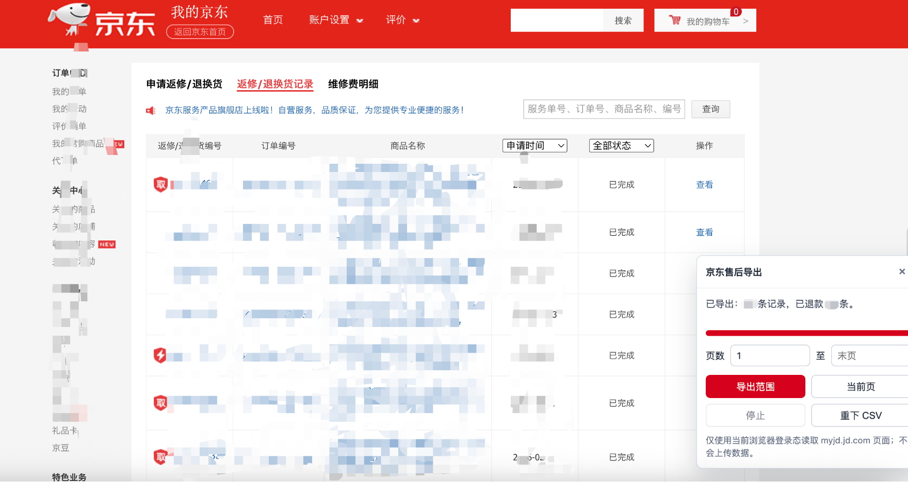

# 京东售后记录本地导出

这是一个只在本地运行的 Chrome/Edge 扩展，用于在京东“返修/退换货记录”页面导出 CSV，并自动打开同域详情页识别处理方式、审核申请时间、审核结束时间和退款总额。

## 安装

1. 打开 Chrome 或 Edge 的扩展管理页。
   - Chrome: `chrome://extensions/`
   - Edge: `edge://extensions/`
2. 开启“开发者模式”。
3. 点击“加载已解压的扩展”，选择本目录：`jd-return-exporter`。
4. 登录京东后打开售后界面：<https://myjd.jd.com/afs/list/allRepairs.action>

## 使用

页面右下角会出现“京东售后导出”面板。

- “导出范围”：按面板里的起止页读取列表，继续跟随“下一页”，并查看每条记录详情。结束页留空表示一直读取到末页。
- “当前页”：只导出当前页识别到的记录。
- “停止”：停止后续读取，保留已抓到的数据。
- “重下 CSV”：重新下载上一次导出的 CSV。

导出文件包含：

- `服务单号`
- `订单号`
- `申请时间`，来自详情页“审核环节”展开后的最早处理时间
- `商品名称`
- `售后类型`
- `列表状态`
- `退款金额`
- `结束时间`，来自详情页“审核环节”展开后的最上方处理时间
- `来源列表页`

## 本地与隐私

扩展没有后台服务，也不会连接第三方接口。它只在 `myjd.jd.com` 页面中运行，用当前浏览器登录态读取京东列表页和详情页，并通过浏览器下载本地文件。

## 识别逻辑

“售后类型”以详情页“商品处理方式”为准：最终处理方式为“退货”则记为退货，为“换货”则记为换货。退货详情页如果出现“退款总额”，会记录退款金额（如果有支付优惠，记录的退款金额会比付款多）；换货记录的退款金额固定为 `0`。
